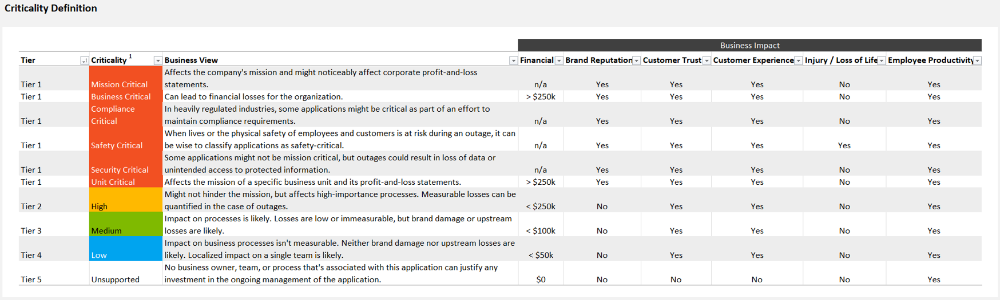
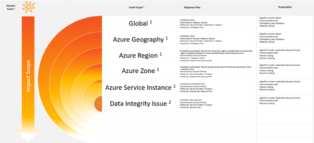
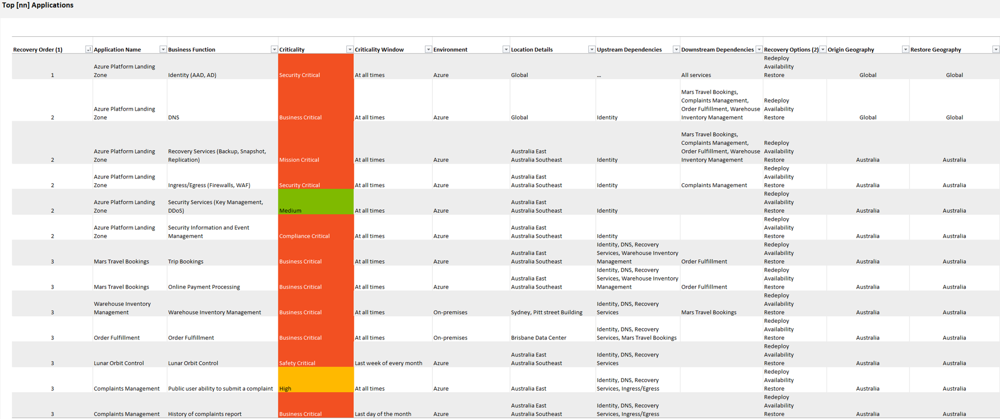

# Introducing the Azure Business Continuity Guide

> [!IMPORTANT]
> It is recommended to open the ABCG Excel Workbook in Desktop View for the best experience!

**Download Latest Release:** [Azure Business Continuity Guide v0.5](https://github.com/Azure/BusinessContinuityGuide/releases/download/v0.5/ABCG.v0.5.xlsx)

## What is the Azure Business Continuity Guide (ABCG)?

The Azure Business Continuity Guide provides a comprehensive set of recommendations to help customers define what BCDR looks like for their applications. Often a customer will ask us for help with their business continuity and disaster recovery plans. Sometimes, the customer simply needs a structured approach to protect one application in Microsoft Azure. In other cases, they have a portfolio of many applications in a hybrid environment that might never have had a good solution to protect everything with a single BCDR framework. In addition, Microsoft Azure offers a variety of services and features to help customers achieve high availability, disaster recovery, and backup for their applications and data. However, planning and implementing a solid strategy can be challenging, especially for complex environments.

That's why we created the Azure Business Continuity Guide. Today, we are pleased to make this guide available to all customers who are adopting BCDR solutions at any point in their journey. Let's take a tour!

## What's included in the Azure Business Continuity Guide?

The ABCG is a comprehensive and practical resource that helps you design and execute a BCDR plan for your Azure resources. The ABCG is published as an [Excel workbook](https://github.com/Azure/BusinessContinuityGuide/releases/download/v0.5/ABCG.v0.5.xlsx), which you can download and customize for your own needs. The ABCG contains a few different elements:

- Select documentation covering the important concepts of BCDR on Microsoft Azure
- Recommended templates to help define your BCDR requirements in a consistent way
- Example assessments, plans and checklists for customers to consider in their own BCDR implementation

The workbook is divided into 3 distinct phases across the BCDR journey, from readiness to application continuity all the way through business continuity.

## Phase 1: Prepare

In this phase we review fundamental concepts to answer the question, "What is the Microsoft Azure BCDR Solution?" This includes documentation on platform features, the shared responsibility model, design patterns and reliability trade-offs (ex. cost) just to name a few of the concepts. We also provide a set of templates that compose a structured methodology for assessing the business continuity of existing applications and facilitating the design of new ones. This approach can improve the overall adoption of BCDR and lead to more consistent planning.

## Phase 2: Application Continuity

From this point we have an iterative set of activities that should be followed for each independent application that needs a continuity plan.

### Assess

Starting with an assessment of the application to determine the requirements and architectural decisions. This should be guided by the business case for each application, which includes data from business impact assessments, service mapping and fault tree analysis among other included examples. Once you have validated your requirements in this way, any gaps in the implementation or design can be addressed during the implement activity.

### Implement

In this activity we develop our response plan for the application that describes the types of events, their scope of impact and the appropriate response (and preparation) that should take place. For example, if a disaster impacts a single Availability Zone within a region we define the automated and/or manual failover activities that need to occur to recover.

Next, we recommend documenting the architectural considerations for each service or component that affects the application's resiliency. This can be defined as a list of requirements with details on how the components meet requirements (i.e. use of availability zones or paired regions). The result is a robust document describing how the application should be implemented to meet the resiliency requirements. Any gaps or unmet requirements should be included so that your contingency planning can account for these items as needed.

Before moving to the next activity, we recommend customers assign roles and responsibilities to the recovery team that will be involved in the BCDR testing. A RACI template is included to help you consistently plan your teams across all applications.

### Test

Without regular testing, even the most robust plan can fail when it's needed most. Testing activities should include a failover plan, recovery plan, acceptance testing, outage communications and a regular review (and update) of all documents that support your application continuity plan. A test summary example is included in the ABCG to help track testing activities and results over time. Don't forget to include appropriate communication plans during tests as well. As you review your testing outcomes, look for ways to improve your plans to reduce costs, recovery times and efficiency.

## Phase 3: Business Continuity

For the final phase of the ABCG, we focus on minimum business continuity objective (MBCO) planning and ongoing management. This involves combining and coordinating the individual application continuity plans for all critical applications.  Your organization should define the risks that are most likely to impact the business (i.e. natural disasters, cyberattacks, power outages, etc). We provide an example list of considerations to include from people and processes to validation and testing. The details from your risk assessment (and the outcomes of all the other activities up to this point) should help define the recovery order of your application portfolio. You should also identify any business critical events for your organization to ensure that BCDR testing does not cause disruption during these times.

## Get Started with the ABCG

The Azure Business Continuity Guide is a living document which we think our customers will value. Over time we plan to improve upon it based on your feedback. Please download a copy of the ABCG and let us know what you find useful, and what might make it even better for others!

## Contributing

This project welcomes contributions and suggestions.  Most contributions require you to agree to a
Contributor License Agreement (CLA) declaring that you have the right to, and actually do, grant us
the rights to use your contribution. For details, visit https://cla.opensource.microsoft.com.

When you submit a pull request, a CLA bot will automatically determine whether you need to provide
a CLA and decorate the PR appropriately (e.g., status check, comment). Simply follow the instructions
provided by the bot. You will only need to do this once across all repos using our CLA.

This project has adopted the [Microsoft Open Source Code of Conduct](https://opensource.microsoft.com/codeofconduct/).
For more information see the [Code of Conduct FAQ](https://opensource.microsoft.com/codeofconduct/faq/) or
contact [opencode@microsoft.com](mailto:opencode@microsoft.com) with any additional questions or comments.

## Trademarks

This project may contain trademarks or logos for projects, products, or services. Authorized use of Microsoft 
trademarks or logos is subject to and must follow 
[Microsoft's Trademark & Brand Guidelines](https://www.microsoft.com/en-us/legal/intellectualproperty/trademarks/usage/general).
Use of Microsoft trademarks or logos in modified versions of this project must not cause confusion or imply Microsoft sponsorship.
Any use of third-party trademarks or logos are subject to those third-party's policies.
