# How to use the ABC Guide

## General Guidance

**It is recommended to open the guide using the desktop version of Excel.** If the file is slow to open or navigate consider saving the guide to a location outside of OneDrive (or turn off AutoSave) since this will cause Excel to pause frequently when writing the file.

### Navigation

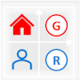

In each page of the guide, you will find quick access navigation buttons at the top left. These buttons will take you to the main sections of the guide.

Navigate to Business Continuity and Disaster Recovery Framework (Home)

Navigate to Personas: Business Continuity and Disaster Recovery by Role and Task

Navigate to Glossary

Navigate to References

### Collapsible Sections

Many of the pages include sections that have been collapsed or expanded by default. Look for the **[+]** and **[-]** buttons to expand or collapse sections.

Collapse this section

Expand this section

### Filters

Some of the pages in the guide have built-in filters you can leverage by simply clicking on the desired button 

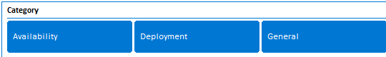 
(Show items in the Availability, Deployment and General categories)

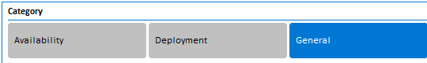 
(Show only items in the General category)

### Footnotes

Many of the templates and examples will include a list of footnotes at the bottom of the worksheets. When first viewing the guide it is a good idea to check the footnotes and become familiar with the details. It will help you understand the templates better.

### Other tips

- Familiarize yourself with the sections of the guide and ensure you are using the latest version. For a high-level introduction you can refer back to the [read me](README.md) in this repo, which gives an overview of each phase of the planning process.
- Be sure to review the Personas view to see how each role is involved (Application Owner, Architects, etc) and the steps in sequence they are responsible for in completing templates in the guide.

---

## Phase 1: Prepare

### Concepts

Building a Business Continuity and Disaster Recovery (BCDR) strategy is crucial for ensuring the resilience of a business in the face of unforeseen disruptions or disasters. This section is composed of important documentation that we recommend reading as you prepare and look back to for reference in later phases. In order to be ready for BCDR strategy discussions, it is strongly suggested to be aware of the concepts in this section.

The Prepare phase of the guide, as well as the other phases, includes numerous footnotes at the bottom of the "home" page. Be sure to look for the superscript numbers and review the footnotes to understand the details of the templates and examples. In some cases the footnotes will include a list of links that apply to a particular concept. For example, you will find 3 links related to Reliability Trade-Offs8:

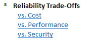

### Supporting Artifacts

In this section you will find the main templates to be used during the BCDR strategy discussion. These templates are meant to be used as a starting point and can be modified to fit your organization's needs. The templates included are as follows:

#### Criticality Model (example)

Enterprise organizations typically have a large application portfolio, but not all applications are of equal importance. Applications should be classified based on a [criticality scale](https://learn.microsoft.com/azure/cloud-adoption-framework/manage/considerations/criticality#criticality-scale). The table should be customized as needed. More suggestions and insights can be found in this article:

**[Business criticality in cloud management](https://learn.microsoft.com/azure/cloud-adoption-framework/manage/considerations/criticality)**

The Criticality Model is a table to be used to summarize the different levels of criticality and the associated business view (what’s going to be impacted in case of outages). Criticality should be identified and classified to direct investment of business continuity, monitoring, support, and other resources appropriately. It should be noted that certain business functions within applications may also be more critical than others.

Creating a criticality scale is the first important step in building the BCDR strategy. It helps in:

- **Understanding priorities:** identify which system, processes or assets are essential for the operations and which ones are less critical (and allocate resources accordingly during a disaster).
- **Allocating Resources:** ensure that the most critical elements are protected to a higher degree, considering that not all parts of the business can receive the same level of investment.
- Facilitating quick, informed decisions during disasters.
- Establishing a clear hierarchy of priorities for better response and recovery.

#### Business Commitment Model

When implementing a BCDR strategy it is important to build a detailed view of all the various aspects of business commitment required for each level of criticality. This is important to ensure that the plan is comprehensive and tailored to the specific needs of each application (according to its criticality level requirements).

Defining business commitments for each application will facilitate a more efficient allocation of resources and a targeted response to potential disruptions, protecting the organization's operations and reputation.

***How to use this template***

For each Criticality Level, define if a specific aspect needs to be calculated or documented and which type of tests are required. Each aspect or test type should be labeled as "Required", "Not Required" or "As Required".

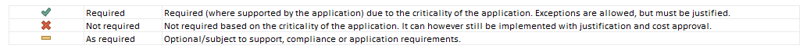

When filling out the template, you can use the following cell values to indicate Required, Not Required or As Required:

✅(Required) = 1 
❌(Not Required) = 2 
➖(As Required) = 3

🔍**ATTENTION:**
The Business Commitment Model template contains several vertical sections that are hidden by default. Be sure to expand the sections to see the full list of requirements. When all the sections are collapsed you can see the condensed topics in a "page size" view and the tables might look empty (as seen below).

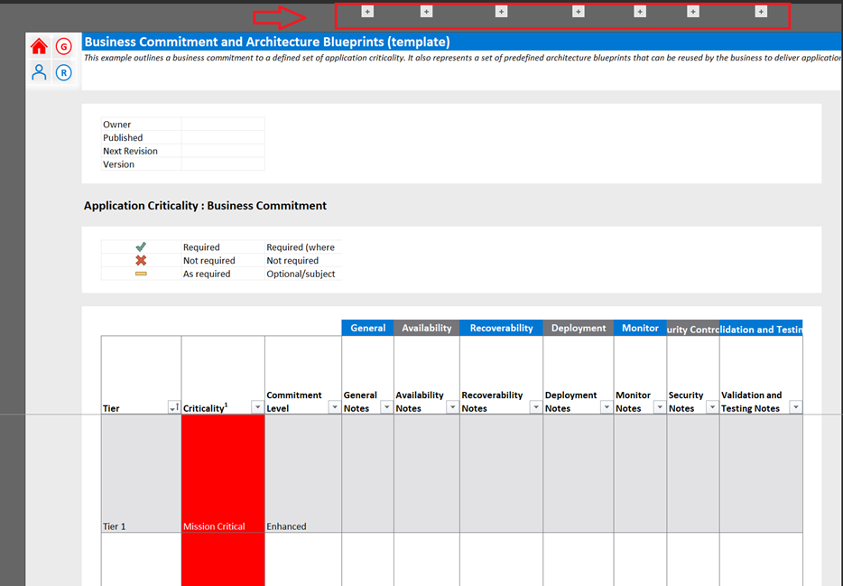

As you can see, for each tier a criticality level is defined and the corresponding commitment level is indicated as follows:

- Enhanced
- Standard
- Base
- None

##### General Requirements

The General requirements are expanded by default with all the considerations that need to be defined. This includes a list of the most important metrics to be defined and all details that needs to be discussed and documented. For example, an SLA of 99.999% being required for your mission critical applications. Mission critical would also have MTD (Maximum Tolerable Downtime), RPO and RTO optionally required. 

Some of the headings in general requirements refer to the need to prepare a specific document (and later in the BCDR strategy implementation, you can reuse examples or fill out templates provided within the ABC Guide – e.g. Business Impact Analysis, Contingency Plan…)

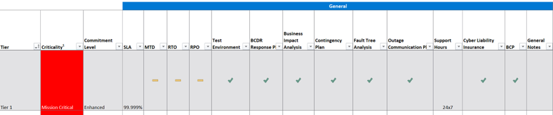

##### Availability Requirements

Availability refers to the degree to which a system or service is operational and accessible when needed. High availability is crucial for mission-critical applications as it minimizes downtime and ensures that users can access services without disruption. Achieving high availability involves redundancy, failover mechanisms, and proactive monitoring.

The aim of the availability requirements is to help you keep track of how you plan to achieve Availability for the different aspects of all the applications belonging to the same criticality group. 

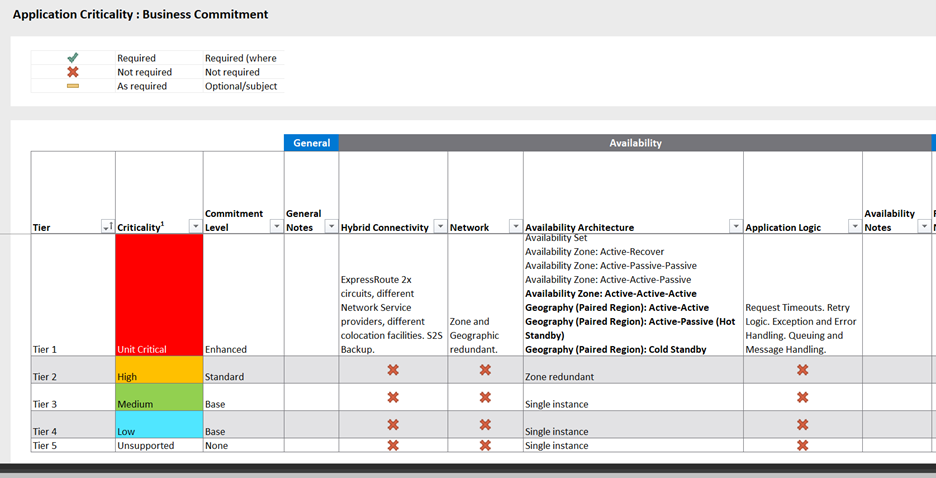

##### Recoverability Requirements

Recoverability is the ability to restore a system or service to its normal state after a disruption or failure. It encompasses the processes and technologies used to recover data, applications, and infrastructure.
In a BCDR strategy, recoverability is essential for business continuity. It includes backup and restoration procedures, disaster recovery plans, and redundancy to minimize data loss and downtime.

With the recoverability requirements you can keep track of the backup retention period required, the recovery architecture and if cross region replication needs to be implemented for a specific group of applications (with the same criticality level).

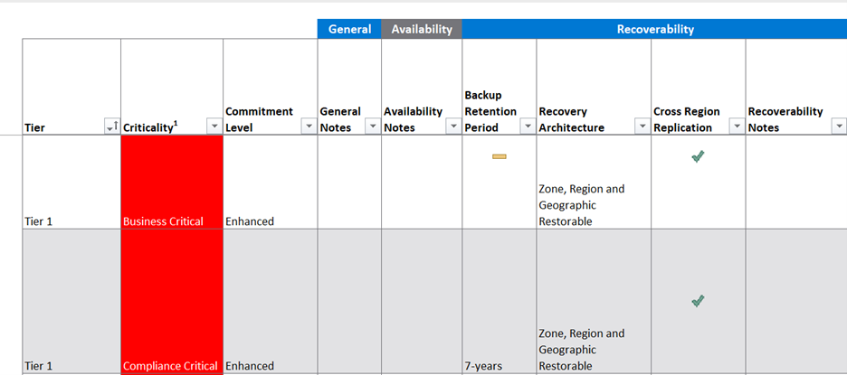

##### Deployment Requirements

Deployment refers to the process of setting up and configuring software applications, infrastructure, and resources to make them operational. Deployment can be done manually or automated, such as through Infrastructure as Code (IaC). Discussing deployment methods is crucial for ensuring consistency and repeatability. Automation, like deploying resources and configurations from a code repository, can help in rapidly restoring systems to their pre-disruption state.

Use the deployment requirements to define what will be implemented for each criticality level according to the business commitment. 

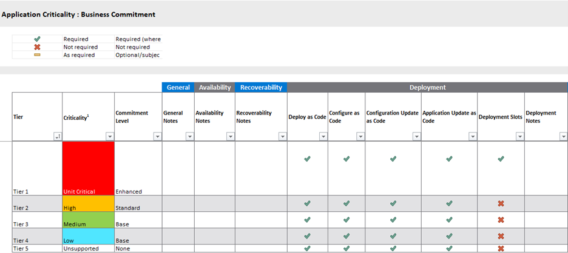

##### Monitoring Requirements

Monitoring involves continuous tracking and observation of the health, performance, and security of systems, applications, and infrastructure. It includes the collection of metrics and alerts for proactive issue detection. Monitoring is essential for identifying anomalies and taking proactive measures to maintain system health and performance. It's a key component for early detection of potential disruptions and planned maintenance.

As it pertains to BCDR planning, you should define the monitoring requirements in detail to ensure that the right metrics and logs are available to support the recovery process. The alerting requirements should include the notification methods and severity thresholds for each criticality level.

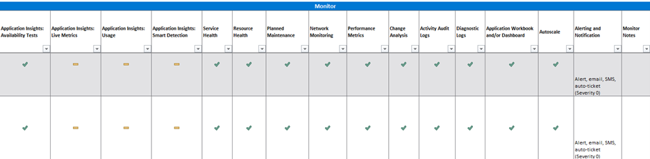

##### Security Control Requirements

Security control refers to measures and procedures put in place to safeguard data, systems, and infrastructure from threats and vulnerabilities. This includes access controls, encryption, firewall rules, and more.

Discussing security controls is vital to prevent security breaches and data loss during and after disruptions. Security measures should be integrated into the BCDR strategy to protect business assets. For example, you may decide to require DDoS Protection for all critical applications, but leave it as optional for all other applications.

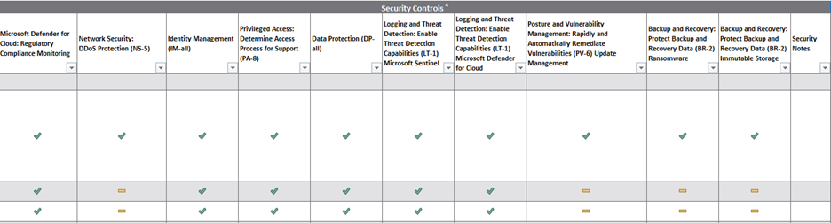

##### Validation and Testing Requirements

Validation and testing processes should be considered for each criticality level. Keep in mind that the highest criticality levels are likely to require the highest level of testing and validation. Types of tests will vary by criticality level too. For example, a mission critical application may require failover testing, load testing, chaos testing, penetration testing and more. A non-critical application may only require failover testing. The frequency of testing should also be defined for each criticality level.

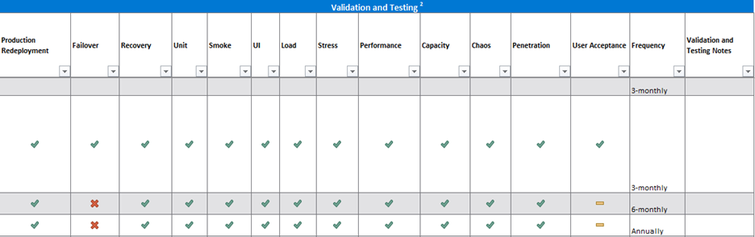

#### Fault Model and Resilience Strategies (example)

A useful preparation step that the organization should consider is to define common types of failures along with agreed resiliency strategies that should be implemented. Documenting types of failure with pre-approved mitigation strategies for each application criticality tier simplifies the tasks of creating business commitment models, performing application fault tree analysis and designing BCDR solutions.

In the example you can see how recovery is planned for different types of scenarios/events to achieve resiliency. The guide provides a good example of what a typical fault model may look like for cloud-based workloads. It is recommended to use a similar approach to document the fault model for your organization. As an alternative, you may simply document the failure modes and mitigation strategies in a document similar to the following article:

**[Failure mode analysis for Azure applications](https://learn.microsoft.com/azure/architecture/resiliency/failure-mode-analysis)**

#### RACI

The RACI table is a project management tool used to clarify roles and responsibilities for each task, activity or decision in a project. This template can be used to define both the application and organization BCDR roles and responsibilities.

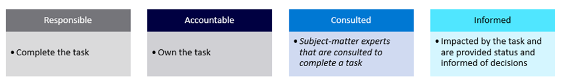

#### Application Requirements (template)

A workshop (or series of workshops) with all relevant stakeholders is recommended to gather relevant information for each application. 

In the template you’ll find a list of requirements grouped by category. You can click on one of the categories listed to automatically filter the requirements listed in the table. You can use this template to assess each application's BCDR requirements for a new or existing system. The responses can then be used in the other templates in this guide.

You will find an example of how this template can be used later in [Phase 2: Application Continuity](#requirements-and-architecture-decision-record).

#### Test Plans (template)

This template defines the types of tests that need to be considered for each application, depending on its criticality and the related business commitment. You will find built-in instructions for each of the mentioned test. A description of the type of test and links are also available in the same table.

- Production Redeployment Test
- Failover + Failback Test
- Recovery Test
- Unit Test
- Smoke test
- UI Test
- Load Test
- Stress Test
- Performance Test
- Chaos Test (also to validate impact on specific components like Entra ID or DNS outage)
- Penetration Test
- User acceptance Test
- Contingency Test

For each test it’s important to define and keep track of the following:
- Frequency / Last Test Date / Next Test Date / If automation and a test schedule are in place.
- Outcome of the tests (functional results, performance results, Duration, RTA, RPA…)
- Owner / people involved

## Phase 2: Application Continuity

In this part of the guide, you’ll find a set of examples you can use as a reference to create your own documentation. Each of the documents in the Application Continuity phase should be edited for each application that needs it (as per discussed while documenting artifacts).

### Assess

In this section we are doing information gathering about each individual application. It is also recommended to complete a [landing zone review](https://aka.ms/review-checklists) at this time.

#### Requirements and Architecture Decision Record

This example is based on the template named "Application Requirements" in the supporting artifacts section of Phase 1. It's filled in with some details to provide a concrete example on how to use it. For each application, a list of requirements should be documented. A workshop (or series of workshops) with all relevant stakeholders is recommended to gather relevant information for each application. The sample questions provided can be used to assess the application BCDR requirements for a new or existing system. The requirements should be marked as required, not required or not applicable.

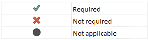

Details that were used in the decision for a requirement to be included (or not) can be noted in the column “Architecture Decision Record”. If necessary, this column can also have hyperlinks out to other records (i.e. [ADRs](https://github.com/joelparkerhenderson/architecture-decision-record)). The responses can then be used in the other templates in this guide.  This list of requirements will be decomposed into architectural considerations for each application later in this phase.

#### Service Map

A Service Map provides a comprehensive view of your organization's IT infrastructure and the interdependencies between services. This understanding is essential for effective BCDR planning.

Creating a Service Map as part of your Business Continuity and Disaster Recovery (BCDR) strategy is a crucial step in understanding and planning for the resilience of your organization. It helps you visualize your IT environment and the dependencies among various services and components. It's a critical component of your BCDR strategy, helping you build resilience and minimize downtime in the face of disruptions.

The images in this example visualize the dependencies for a single application. Customers are encouraged to use a service map template or tools outside of the ABC Guide to build these visualizations. The guide can still be used to document a list of the components that are part of the service map.  Two links at the bottom (in the notes) are helpful to discover dependencies that may need to be included in a good service map:

- [Application Insights](https://learn.microsoft.com/azure/azure-monitor/app/app-map?tabs=net) shows dependencies that are discovered for an application (e.g. databases, storage accounts, APIs)
- [VM Insights](https://learn.microsoft.com/azure/azure-monitor/vm/vminsights-maps?source=recommendations) shows network dependencies that are discovered for a VM (e.g. ports and network addresses)

#### Business Impact Analysis

A Business Impact Analysis is an activity used to determine the criticality of an application. On top of the document we suggest to add:

- A recap of the application details and its architectural diagram to help understanding the scenario.
- An impact summary that explains how much an application is used and the “positive impact” generated by the application (e.g. revenue per hour). This help explain the negative impact and the financial loss in the case of a 1 hour outage and define the impact cost.

Required Metric Values to be defined are (most of these terms can also be found in the glossary):

- Composite Service Level Objective
- Recovery Time Objective
- Recovery Point Objective
- Throughput Objective (example: minimum transactions per minute/second/hour before it is impactful to business)
- Response Objective (example: maximum response time before it is impactful to business)
- Maximum Tolerable Downtime

Use this tool to keep track of assessment history and dependencies. **Upstream dependencies** (which the application depends on) should be documented as well as **downstream dependencies** (which depend on the application) in terms of how they meet the objectives. The BIA needs to be reviewed routinely. Including the key findings of test results and metrics provides context to the business decision makers. In essence, equating desired metrics to achieved metrics while balancing impact and risk.

At the bottom of this example there is a link to a [Sample Business Impact Assessment template](https://learn.microsoft.com/compliance/assurance/assurance-developing-your-ebcm-plan) that can be used to document assessments for each application.

#### Fault Tree Analysis (-BCDR)

The fault tree analysis is a top-down approach you can use to determine the cause of a specific event that caused an application to stop working as expected. It’s a powerful tool for improving the reliability of cloud applications.

Break out the root cause of a (potential) failure into its contributing factors and represent it through a graphical model known as a fault tree. This helps identify potential failure modes and the related probability for reliability analysis. The goal is to break down a complex issue into manageable parts to help:
- Understand potential causes of failures.
- Identify potential failures point and mitigate risks.

It’s a proactive approach to identifying potential issues before they occur, helping you build more reliable and resilient applications on Azure.

#### Architecture | Continuity Gap Assessment (-BCDR)

This template can be used to document the current application availability and recovery configuration (or planned configuration) by component and critical business function. At the bottom of the sheet, the total cost of ownership (including any existing availability and recoverability components) is also calculated.

At the time of the assessment the application in the example is made up by several components (MS Entra ID, Azure DNS, App Service Plan, Azure Service Bus, etc). For each of the component, all the requirements need to have an associated value. This document contains built-in guidance.

#### Metric Analysis

This template is used to record various metrics and calculate composite scores across the metrics. The information is then presented on the Fault Tree Analysis and BCDR Dashboard.

Metric Analysis will help in calculating a reliability score (and the secure score) for the application itself and for the different service involved.

This tool contains several tables to provide different aggregated views:

- Summary
- All Services related to the application
- Services involved per specific business functions

### Implement

After completing all the tasks in the “Assess” section of this phase, the work of designing BCDR components can begin. Many of the examples you see here are “future state” versions of the templates that were created during Assess. For example, you will see a new version of the Architecture which now includes BCDR changes to address any gaps that were found. Another example will be the metrics should now be recalculated to show estimated improvements based on the architecture design changes.

#### Response Plan by Scope

Different disaster events will have a different scope of impact and, therefore, a different response.

A response plan defines the types of disaster events, their scope of impact, along with the planned recovery response and preparation activities.

For the application consider:

1) The scope of events that may affect the application continuity.
2) The responses that needs to be planned for each event scope. Include details for availability, recoverability and the resources that will be involved in recovery.
3) The preparation that the business will commit to for the application.

Disaster Event:

| Impact Scope | Possible Causes |
| --- | --- |
| - Global - Azure Geography - Azure Region - Azure Zone - Azure Service Impact | natural disaster, internet, power grid, service failures, etc |
| - Data integrity issue | human error, transfer errors, bugs and viruses, data corruption, etc |

Refer to the [Business Risk](#business-risk) example in Phase 3: Business Continuity for more information and related types of disasters that may lead to the defined event scopes.

#### Architecture | Continuity Design (+BCDR)

This document is the same as the “[Architecture | Continuity Gap Assessment](#architecture--continuity-gap-assessment--bcdr)”, but it contains additional elements that are needed to improve the BCDR strategy. Please note the blue dotted line that highlights what was modified/introduced (compared with the current state design from the assessment section):

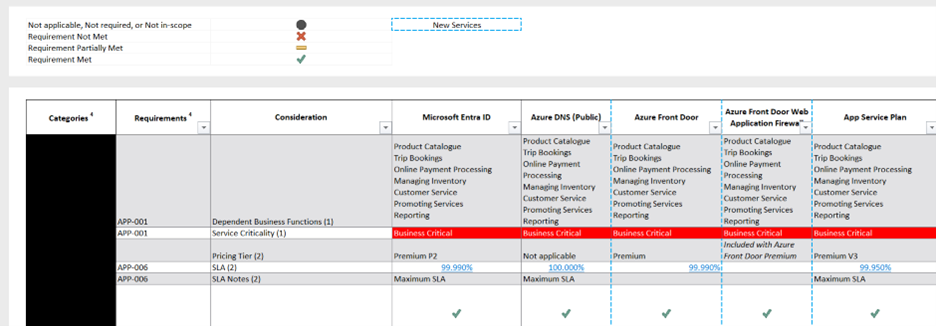

Please ensure to scroll to the right and notice the remediation summary notes that were added for the application in the example. You should consider documenting the changes in a similar way. Another important aspect to note is the last column “Gap Analysis” in the example has been updated compared to the assessment document mentioned above.

#### Cost Comparison (-BCDR vs. +BCDR)

This example shows how to calculate and compare the application costs before and after BCDR components are added.

It shows the overall additional cost of improving BCDR, a recap of the costs of the whole application (all the services) before the resilience remediation and after. Then it replicates the same approach and calculations for the different business functions.

#### Metric Comparison (+BCDR)

This template is used to record various metrics and calculate composite scores across the metrics. The information is then presented on the Fault Tree Analysis and BCDR Dashboard.

This example leverages similar concepts to the [Metric Analysis](#metric-analysis) that was done as part of the Assess section but aims to show benefits of adding BCDR solutions.

#### Fault Tree Analysis (+BCDR)

This sample fault tree analysis represents the fault tree after BCDR remediation. This data, along with the defined requirements, and Business Impact Analysis are the essential inputs to create a business case for Application Continuity.

For a better understanding, please consider comparing the animation in the guide with the one in the [Fault Tree Analysis (-BCDR)](#fault-tree-analysis--bcdr) example from the Assess section.

#### Contingency Plan

A contingency plan defines how operations will be continued in the event that the system cannot be restored back to operation.

In this guide you find an example that describe how employees should respond in case the application is not working (e.g., manage request using the phone, collecting information manually...)

#### Role Assignment

This template can be used to assign application and organization BCDR roles. The roles and responsibilities should be defined in the RACI template from the Prepare phase. This template can be used to assign specific people to each role. Important contact details such as phone, email and time zone should be included.

### Test

After completing the implementation of the BCDR strategy, it is important to test the solution to ensure that it meets the requirements. Keep in mind that the documented implementation must be executed (aka "deployed") in order to realize the design components that were detailed in the previous section. The following templates can be used to plan and document the testing activities.

#### Test Summary

The example here is based on the [Test Plan template](#test-plans-template) but with concrete examples. Particular attention should be given to the Notes section under the table in this worksheet. The notes describe the difference between shift right (testing in production) vs. shift left (testing in pre-production) and full scale vs. review plan vs. simulation testing activities.

#### Continuity Drill (Failover Test)

The example describes failover and failback procedures / tasks needed for the application.

A list of business functions that are provided by the application is included at the top along with the criticality for each function. This will dictate which functions are included in the failover procedure. Next (below the table of business functions) it gives a summary of the steps that need to be completed in sequence to perform the failover and failback. It is usually necessary to include a link to more detailed procedure documentation that would be followed during a failover event.

#### Test Plan (UAT)

Again we start by listing the business functions, the same as we did on the Continuity Drill example. Next we give a summary of the test steps that should be taken during UAT testing by the QA professional (or similar role). The detailed steps should be linked from this example to whatever documentation is used for UAT testing by the QA role.

#### Outage Communication Plan

The Outage Communication Plan template should be used during application outages to track what happened (it’s organized by event scope). The customer should define their own set of questions to be completed before an outage, and questions to complete after. We have provided some examples of this but each customer may need to consider additional questions.

#### Maintain Application Continuity

A maintenance plan for application continuity is provided as an example. All documents that should be regularly reviewed and updated are listed.

For each application consider:

- The documents, activities or automation artifacts that need to be reviewed on a regular basis
- Frequency / next planned review
- Owner of the review process
- Approver of the completed review

## Phase 3: Business Continuity

### Business Continuity Plan

A BCP is a document that outlines how a business will continue its operations in the event of an unplanned disruption to its business-critical applications. Building a Business Continuity Plan (BCP) document is a critical process for ensuring an organization's ability to maintain essential business functions in the face of disruptions or disasters.

Industry-standard and jurisdiction-specific BCP templates are available on the internet. Consider the items listed in the ABC Guide when developing a Business Continuity Plan.

In this document you’ll find all the important considerations to take into account and a link to the documents (included in the ABC Guide) that are meaningful to implement a good BCP.

#### Business Risk

The organization should define risks that are most likely to impact the business. Risk is based on the hazard being assessed and the organization's exposure to the risk.

Risk associated with an incident can be defined as “the impact of that incident multiplied by the probability of the incident happening”.

An example of **High Risk** (High Probability and High Impact) is data breach. Given the increasing number of cyber attacks, the probability of a data breach is relatively high. If an attacker gains unauthorized access to your application, they could potentially access sensitive data, modify your application’s behavior, or even cause downtime. The impact of such an event is also high, as it could lead to significant financial losses, damage to your company’s reputation, and loss of customer trust.

An example of **Low Risk** (Low Probability but High Impact) could be a major natural disaster such as an earthquake or a flood affecting the physical location of Azure data centers. While Azure has multiple data centers around the world to ensure redundancy and minimize the impact of such events, the possibility still exists. The probability of this happening is extremely low, but if it were to occur, the impact could be huge, potentially causing significant downtime. However, Azure’s extensive disaster recovery and backup strategies would likely mitigate this risk.

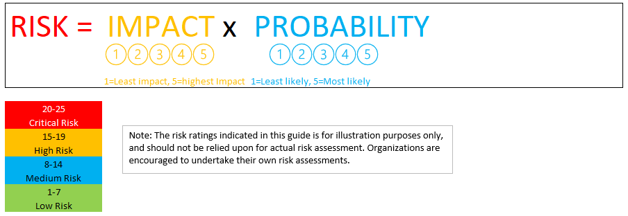

#### Minimum Business Continuity Objective (MBCO)

This document outlines how a business will continue its operations in the event of an unplanned disruption to its business-critical applications. The business is recommended to determine the Minimum Business Continuity Objective (MBCO). This represents the minimum number of applications and/or business functions that need to be available or made available before the maximum tolerable downtime (MTD) is reached in order for the business to achieve its objectives during a disruption.

It’s important to note that a recovery order needs to be defined in order to respect dependencies and define the responsible recovery teams that might be involved. Applications with the same recovery order can be recovered at the same time.

#### Business Critical Function Calendar

A Business Critical Function Calendar lists all critical business events for the organization. These are business activities and processes that must be restored in the event of a disruption to ensure the ability to protect the organization’s assets, meet organizational needs, and satisfy regulations. Critical dates must be considered when scheduling BCDR drills.

You can consider adding Azure Planned Maintenance events to this calendar. Azure offers a suite of experiences to keep you informed about the health of your cloud resources. This information includes current and upcoming issues such as service impacting events, planned maintenance, and other changes that may affect your availability.

Although you see the calendar in an excel format (as this made it easier to include the example in the guide), please consider evaluating the use of a calendar tool.

#### Business Impact Analysis | Portfolio Summary

This page represents a summary of the Business Impact Analysis for all the applications in the portfolio. It’s a good way to have a quick overview of the criticality of the applications and the related business impact. In the provided example, it is a static view of the data that was collected in the [Business Impact Analysis](#business-impact-analysis) template.

#### Business Continuity and Disaster Recovery | Dashboard

The Business Continuity and Disaster Recovery dashboard captures all relevant application architecture, requirements, processes, plans, policies, test schedules, metrics, current and historical status to help you recover or remain operational in the case of a disaster.

In the provided example, the content of the dashboard is not automatically updated. In a real scenario, you should consider using a tool that can automatically pull data from the different sources and provide a dynamic view of the data.

#### Maintain Business Continuity

An example of the maintenance plan for business continuity. All documents that should be regularly reviewed and updated are listed.

For the business, consider:

1. The documents, activities or automation artifacts that need to be reviewed on a regular basis.
2. The frequency of review.
3. The owner of the review process.
4. The approver of the completed review.
